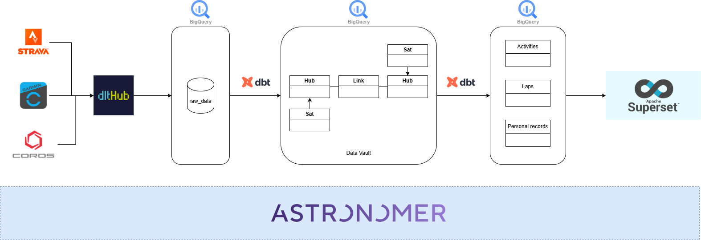

Why?
====
I have use multiple apps and devices for recording my workout activities. Then, in order to consolidate all of those records, I write this project to do this.
There is some apps to do this (Strava) but it comes with subscription to open not only premium features, but also basic statistics.

Orchestration
====

Components
====
Data ingestion: DLTHub - New tool that I have learn in 2024
Data transform: Dbt
Data warehouse: BigQuery
Data model: Data vault - approach that I have faced recently, allow for other future workout type, equipment type, ....
Data visualization: Superset (TBA)
Orchestrator: Astronomer

How to start?
====
(TBA)